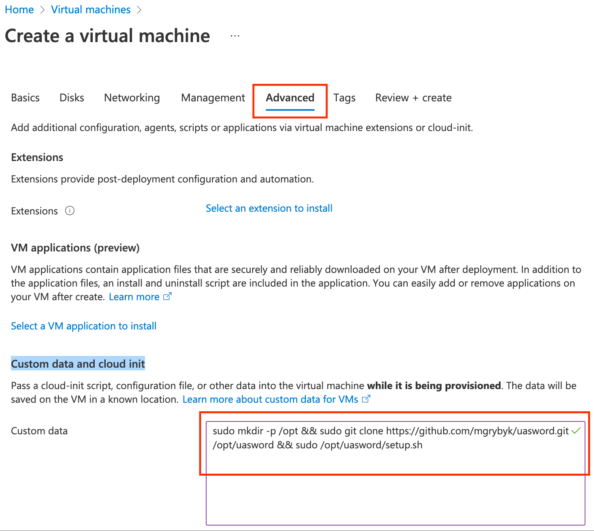

# uasword 

[](https://github.com/mgrybyk/uasword/actions/workflows/test.yml)

> Multitarget tool based on uashield, db1000n and additional advanced dns lists.

DISCLAIMER: the software is not meant to be used for any kind of illegal or inappropriate purposes!


- run in Docker, [Termux](#Termux) or anywhere with Nodejs installed.
- process multiple targets in parallel
- advanced DNS
- uses real browser to improve intensity
- IT ARMY of Ukraine lists are included as well
- targets list updates automatically, run once and let it work

## Installation and Running

- make sure to have [NodeJS 16](https://nodejs.org/en/download/) installed
- clone the repo with [git](https://git-scm.com/download) `git clone https://github.com/mgrybyk/uasword.git`
- `cd uasword`
- install modules `npm install`
- download chromium `npx playwright install --with-deps chromium`
- run `node index`

See [screenshot](docs/image.png) for step by step example for very new users

## Targets

Several target lists is used, see [data/config.json](https://github.com/mgrybyk/uasword/blob/master/data/config.json) for more information.

## Docker

Docker image published to https://hub.docker.com/r/atools/uasword

## Azure Custom Data



Install:
```
sudo mkdir -p /opt && sudo git clone https://github.com/mgrybyk/uasword.git /opt/uasword && sudo /opt/uasword/setup.sh
```

### See Logs in Azure

`journalctl -xe -u uasword.service -f`

## Termux

Note: Play Store version of Termux is no longer updating, please use other apk providers, see below.

1. Install [Termux](https://termux.com/). Choose one of [F-Droid](https://f-droid.org/en/packages/com.termux/) | [GitHub](https://github.com/termux/termux-app/releases/tag/v0.118.0) | [apkpure](https://apkpure.com/termux/com.termux)
2. In Termux run the following
3. `pkg update` answer `y` when prompted
4. `pkg install nodejs-lts` - installs nodejs
5. `pkg install git` - installs git
6. `git clone https://github.com/mgrybyk/uasword.git` - clones the repo
7. `cd uasword` - switch to the cloned folder
8. `npm install --omit dev --no-fund --no-audit` - install modules. Or just do `npm i`
9. `node index` - starts the app


