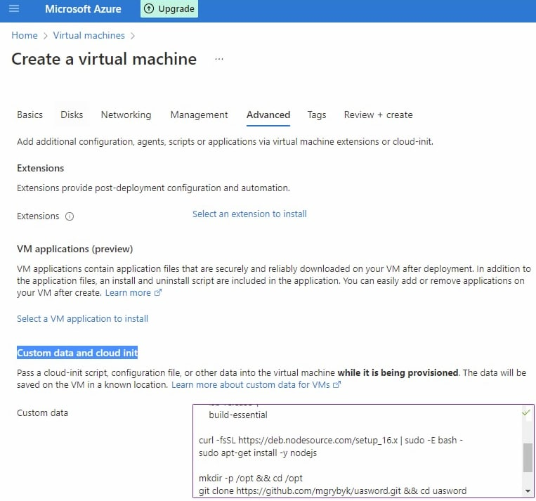

# uasword 

> Optimised headless version of https://github.com/opengs/uashield

See also https://help-ukraine-win.super.site/

## Installation and Running

- make sure to have [NodeJS 16](https://nodejs.org/en/download/) installed
- clone the repo with [git](https://git-scm.com/download) `git clone https://github.com/mgrybyk/uasword.git`
- `cd uasword`
- install modules `npm install`
- run `node index`

## Targets

The list of targets is provided by [uashield](https://github.com/opengs/uashield), see the [sites.json](https://raw.githubusercontent.com/opengs/uashieldtargets/v2/sites.json)

## Docker

Docker image published to https://hub.docker.com/r/atools/uasword

## Azure Custom Data

[]

```
#!/bin/sh

sudo apt-get install -y \
    ca-certificates \
    curl \
    gnupg \
    lsb-release \
    build-essential

curl -fsSL https://deb.nodesource.com/setup_16.x | sudo -E bash -
sudo apt-get install -y nodejs

mkdir -p /opt && cd /opt
git clone https://github.com/mgrybyk/uasword.git && cd uasword
npm install

echo "@reboot cd /opt/uasword && git fetch && git rebase && npm install && node index >log.log 2>&1" > /opt/cronjob
crontab /opt/cronjob

node index >log.log 2>&1
```

### See Logs in Azure

`sudo tail -f /opt/uasword/log.log`
